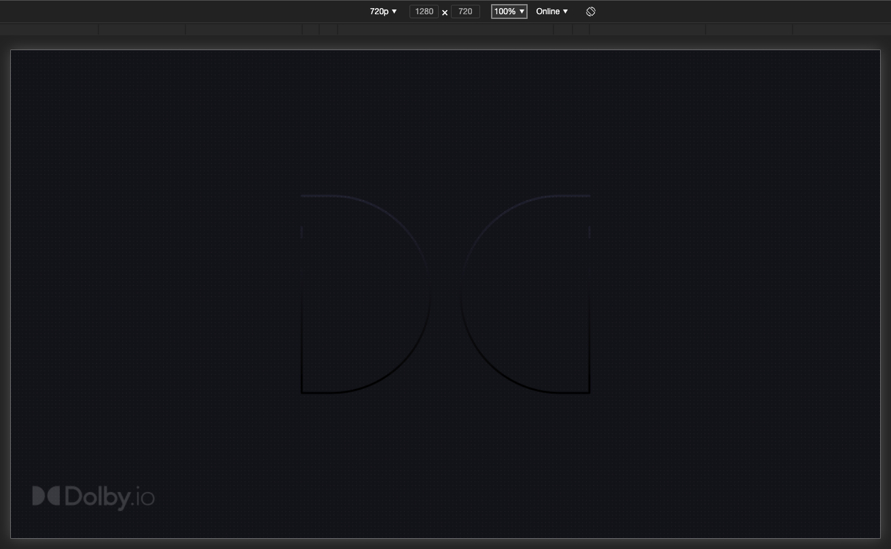
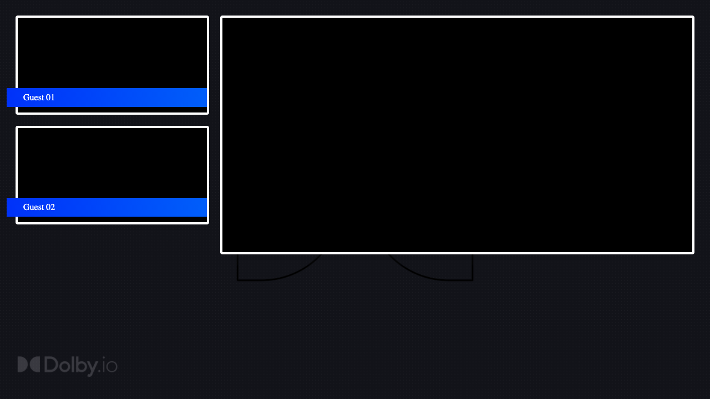
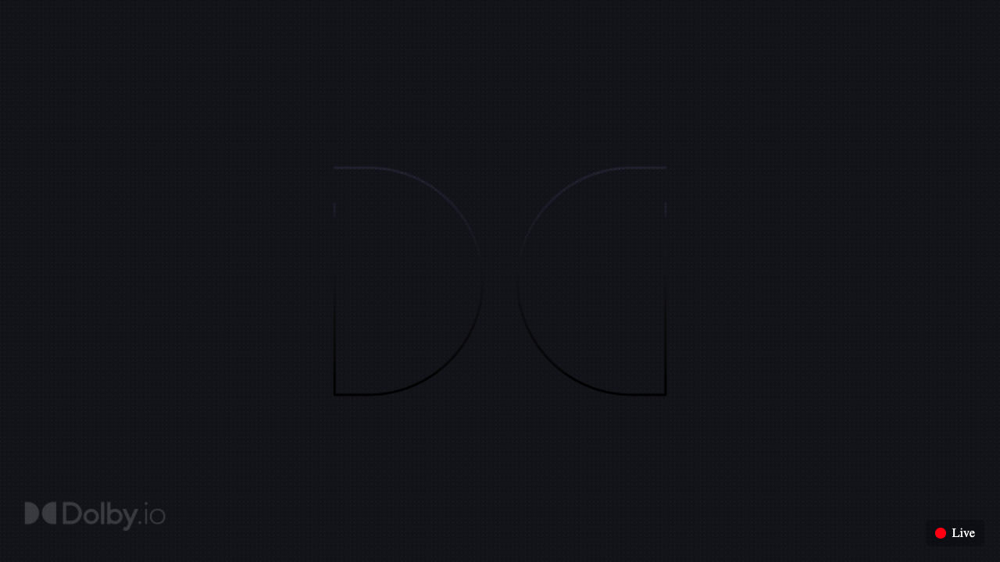
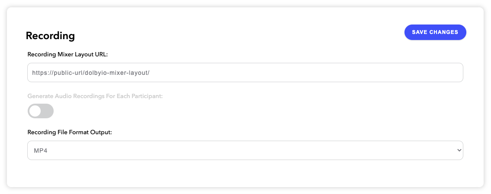

# Blog post - Mixer layout application for dolby.io

## Introduction

A mixer layout application is a web app that the Dolby Interactivity APIs platform uses to generate the layout for a recording or to live stream a conference. A single application can generate a different presentation depending on the target. The mix can be of either a live conference or of a conference that has been recorded. The output can be an MP4 video file or streamed to a [Real-Time Messaging Protocol](https://en.wikipedia.org/wiki/Real-Time_Messaging_Protocol) (RTMP) endpoint like YouTube or Facebook, or using the Dolby own [HTTP Live Streaming](https://en.wikipedia.org/wiki/HTTP_Live_Streaming) (HLS) delivery system. The resulting presentation can contain the video from each participant, as well as screen shares, presentation files or videos being shared, and the size and position of each is under the control of the layout app. As participants join and leave, start and stop video streams or screen shares, presentation files or video sharing, the layout app is updated with these changes, allowing for a dynamic layout.

When you record or live stream a conference, the dolby.io platform will use a default web application to generate the capture the video of your conference. This default mixer layout application is open source, based on React.JS and available on GitHub in the [voxeet-uxkit-web-mixerlayout](https://github.com/voxeet/voxeet-uxkit-web-mixerlayout) repository. If you wish to update this layout to match your corporate branding or have a custom logic you want to implement, just clone the repository, make your changes, publish it online and provide the URL in your dashboard on dolby.io.

In this tutorial, will create a simple layout using JavaScript and jQuery that we can use for recording and live streaming. You can import any JavaScript library that you want into your application, you can connect to any backend you need to pull information from. The only thing you need to remember is that the web application, libraries and backends must be publicly accessible from our platform.

After each of the following steps of this tutorial, you will find a link to the code so you can easily get the latest going.

1. [Let's get started](#lets-get-started)
1. [Layout initialization](#layout-initialization)
1. [Custom presentation](#custom-presentation)
1. [Connect the Voxeet SDK to our layout](#connect-the-voxeet-sdk-to-our-layout)
1. [Layout type](#layout-type)
1. [Test your layout](#test-your-layout)
1. [Publish your layout](#publish-your-layout)
1. [Resources](#resources)


## Let's get started

Consider that we want to use the Dolby Interactivity APIs platform to host a series of webinar type of events that will be recorded and live streamed online. At the end of this tutorial, the goal is for you to understand how you can create your very own mixer layout application that matches your company's branding so you can use to generate recordings or live stream to your end users.

The mixer layout is a web application, so we are going to create a very simple html page with some JavaScript to generate a layout based on the dynamic of the conference, and some CSS to make it nicer. To make things simpler, for our webinars, we will have no more than 2 participants with the video on. The hosts we will be able to play a video and start a screen share.

Let's start by creating an html page `index.html` that contains a link to `script.js` and `styles.css` files from the same folder. We need our web application to load the [Voxeet SDK](https://www.npmjs.com/package/@voxeet/voxeet-web-sdk) and to make our life easier, we will use [jQuery](https://jquery.com) to manipulate the DOM elements of our page. So add those scripts to the header of the HTML page. Here is the full content of the page:

```html
<html>
<head>
    <meta charset="UTF-8">
    <meta name="viewport" content="width=device-width, initial-scale=1.0">

    <!-- Voxeet SDK and jQuery from the CDN unpkg.com -->
    <script type="text/javascript" src="https://unpkg.com/@voxeet/voxeet-web-sdk"></script>
    <script type="text/javascript" src="https://unpkg.com/jquery"></script>

    <!-- Mixer layout script and styles -->
    <script type="text/javascript" src="script.js"></script>
    <link rel="stylesheet" type="text/css" href="styles.css" />
</head>
<body>
    
</body>
</html>
```

Let's create an empty file `script.js` in the same folder as the HTML page, where we will write the logic of the application in the next step.

The mixer is capturing the conference video in 720p so we will use a background image `background.png` with a resolution of 1280x720 pixels. Create the CSS file `styles.css` to load the background picture in full screen. Use this file to customize the colors and define your company's branding.

```css
body {
    background-image: url('background.png');
    background-size: cover;
    background-repeat: no-repeat;
}
```

I highly recommend you create a custom "device" in Google Chrome Developer Tools with the 1280x720 resolution (as pictured below) in order to get the same experience as in the output of the mixer. Open the file `index.html` in Chrome and this is what your web application should look like at this end of this first step.



As of the publication of this article, the Dolby mixer application is using Chrome 87 to load the mixer web application. To make sure the result that you get out of the recording or the live stream is what you expect, please use the same version on your local development machine.

> Download the [source code](1-getting-started/) for this first step.


## Layout initialization

The mixer layout application is a basic web site that has no idea what credentials to use to connect to the Dolby Interactivity APIs, or what conference to join... To provide these settings, when a mixer is requested to record or live stream a conference, it will start the website and inject all the required information into the HTML using input elements. When the mixer is ready to process the conference, it will simulate a click on one of a couple of buttons to tell your application to join or reply a conference. We do not need those elements to appear on the UI so we can hide them using the CSS class `hide`.

```css
.hide {
    display: none;
}
```

Insert this code in the body of the HTML page.

```html
<div class="hide">
    <input type="hidden" value="accessToken" id="accessToken" name="accessToken"/>
    <input type="hidden" value="refreshToken" id="refreshToken" name="refreshToken"/>
    <input type="hidden" value="refreshUrl" id="refreshUrl" name="refreshUrl"/>
    <input type="hidden" value="voxeet" id="conferenceId" name="conferenceId"/>
    <input type="hidden" value="1234" id="thirdPartyId" name="thirdPartyId"/>
    <input type="hidden" value="stream" id="layoutType" name="layoutType"/>
    <button id="joinConference">Join conference</button>
    <button id="replayConference">Replay conference</button>
</div>
```

We create the `initializeVoxeetSDK()` function in our JavaScript file that uses the `accessToken`, `refreshToken` and `refreshUrl` settings injected by the mixer to initialize the Voxeet SDK.

```javascript
// Initialize the SDK with the access token
const initializeVoxeetSDK = () => {
    // Load the settings injected by the mixer
    const accessToken = $("#accessToken").val();
    const refreshToken = $("#refreshToken").val();
    const refreshUrl = $("#refreshUrl").val();

    // Reference: https://dolby.io/developers/interactivity-apis/client-sdk/reference-javascript/voxeetsdk#static-initializetoken
    VoxeetSDK.initializeToken(accessToken, () =>
        fetch(refreshUrl, {
            method: 'POST',
            headers: {
                'Content-Type': 'application/json',
                'Authorization': 'Bearer ' + accessToken
            },
            body: { refresh_token: refreshToken }
        }).then(d => d.json().access_token)
    );
};
```

When the mixer is ready to start its job, it will be waiting for a `div` element with the id `conferenceStartedVoxeet` to be present in the DOM. When the document is ready, we can use jQuery to create that div at the end of the body of our web page. This empty div will not be visible in the layout, it is just a way to signal the mixer that the application is ready to roll. Right before creating the div element, this is where you might want to customize your application UI based on the type of layout requested by the mixer. We will do just that in the [Layout type](#layout-type) section.

```javascript
$(document).ready(() => {
    // Inform the mixer that the application is ready to start
    $("<div />").attr("id", "conferenceStartedVoxeet").appendTo("body");
});
```

With the same concept, our application needs to signal the mixer when the conference we are recording or streaming has ended. To do so, we need to create a `div` element in the DOM of the web page with the id `conferenceEndedVoxeet`. We will capture the events `left` and `ended` from the conference object in the Voxeet SDK. When the mixer detects this div element, it will safely exit and move onto the next job.

```javascript
const onConferenceEnded = () => {
    $('#conferenceStartedVoxeet').remove();
    $('body').append('<div id="conferenceEndedVoxeet"></div>');
};

VoxeetSDK.conference.on("left", onConferenceEnded);
VoxeetSDK.conference.on("ended", onConferenceEnded);
```

When a mixer joins a live conference that you want to record or live stream, it will simulate a click on the `joinConference` button. We need to trigger an action when it happens.

```javascript
$("#joinConference").click(() => {
    // Initialize the SDK
    initializeVoxeetSDK();

    // Load the settings injected by the mixer
    const conferenceId = $("conferenceId").val();
    const thirdPartyId = $("thirdPartyId").val();
    const layoutType = $("layoutType").val();

    const mixer = {
        name: "Mixer",
        externalId: "Mixer_" + layoutType,
        thirdPartyId: thirdPartyId,
    };

    const joinOptions = {
        constraints: {
            video: false,
            audio: false
        },
        mixing: {
            enabled: true
        },
        userParams: {},
        audio3D: false
    };
    
    // Open a session for the mixer
    VoxeetSDK.session.open(mixer)
        .then(() => VoxeetSDK.conference.fetch(conferenceId))
        // Join the conference
        .then((conference) => VoxeetSDK.conference.join(conference, joinOptions))
        .catch((err) => console.log(err));
});
```

When a mixer is requested to generate a recording of a conference that has already happened, it will simulate a click on the `replayConference` button. This can happen if you want to use a new layout application or if you did not use the [liveRecording](https://dolby.io/developers/interactivity-apis/client-sdk/reference-javascript/model/conferenceparameters#liverecording) setting when creating the conference. We need to trigger an action when it happens.

```javascript
$("#replayConference").click(() => {
    // Initialize the SDK
    initializeVoxeetSDK();

    // Load the settings injected by the mixer
    const conferenceId = $("conferenceId").val();
    const thirdPartyId = $("thirdPartyId").val();
    const layoutType = $("layoutType").val();

    const mixer = {
        name: "Mixer",
        externalId: "Mixer_" + layoutType,
        thirdPartyId: thirdPartyId
    };
    
    // Open a session for the mixer
    VoxeetSDK.session.open(mixer)
        .then(() => VoxeetSDK.conference.fetch(conferenceId))
        // Replay the conference from the beginning
        .then((conference) => VoxeetSDK.conference.replay(conference, 0, { enabled: true}))
        .catch((err) => console.log(err));
});
```

The base of our layout application is ready, the mixer is capable of running your application, joining (or replaying) a conference and releasing the resources at the end of it. In the next step we will start creating our custom presentation.

> Download the [source code](2-layout-initialization/) for this second step.


## Custom presentation

We want to build a webinar type of event with the following characteristics:
- Up to two participants with video turned on.
- When someone requests to play a video, we will have the video player taking the whole screen.
- A participant screenshare will be displayed in a larger area on the side of the layout.

At the end of the `body` in the HTML code, add the following container to host the video streams from the participants.

```html
<div id="videos-container"></div>
```

In the JavaScript code, create the function `addVideoNode(participant, stream)` to add a video element when a participant joins the conference and the function `removeVideoNode(participant)` to remove the video element when the participant leaves or turns off the webcam.

```javascript
// Add the video stream to the web page
const addVideoNode = (participant, stream) => {
    let participantNode = $('#participant-' + participant.id);

    if (!participantNode.length) {
        participantNode = $('<div />')
            .attr('id', 'participant-' + participant.id)
            .addClass('container')
            .appendTo('#videos-container');

        $('<video />')
            .attr('autoplay', 'autoplay')
            .attr('muted', true)
            .appendTo(participantNode);

        // Add a temporary banner with the name of the participant
        let name = $('<p />').text(participant.info.name);
        let bannerName = $('<div />')
            .addClass('name-banner')
            .append(name)
            .appendTo(participantNode);

        // Remove the banner after 15 seconds
        setInterval(() => bannerName.remove(), 15000);
    }

    // Attach the stream to the video element
    navigator.attachMediaStream(participantNode.find('video').get(0), stream);
};

// Remove the video stream from the web page
const removeVideoNode = (participant) => {
    $('#participant-' + participant.id).remove();
};
```

Still in the JavaScript code, create the function `addScreenShareNode(stream)` to add the video element for when someone turns on screensharing and create the function `removeScreenShareNode()` to remove it when the screensharing is stopped.

```javascript
// Add a screen share stream to the web page
const addScreenShareNode = (stream) => {
    let screenshareNode = $('<div />')
        .attr('id', 'screenshare')
        .appendTo('body');

    let container = $('<div />')
        .addClass('container')
        .appendTo(screenshareNode);

    let screenShareNode = $('<video />')
        .attr('autoplay', 'autoplay')
        .appendTo(container);

    // Attach the stream to the video element
    navigator.attachMediaStream(screenShareNode.get(0), stream);
}

// Remove the screen share stream from the web page
const removeScreenShareNode = () => {
    $('#screenshare').remove();
}
```

When a participant requests to play a video, create the function `addVideoPlayer(videoUrl)` to create a video player and start the video in full screen. Create the function `removeVideoPlayer()` to remove the video element once the video is stopped. There are a couple more functions that we can add to support all the scenarios about the video: `seekVideoPlayer(timestamp)` and `pauseVideoPlayer()`.

```javascript
// Add a Video player to the web page
const addVideoPlayer = (videoUrl) => {
    $('<video />')
        .attr('id', 'video-url-player')
        .attr('src', videoUrl)
        .attr('autoplay', 'autoplay')
        .attr('playsinline', 'true')
        .appendTo('body');
};

// Move the cursor in the video
const seekVideoPlayer = (timestamp) => {
    $('#video-url-player')[0].currentTime = timestamp;
};

// Pause the video
const pauseVideoPlayer = () => {
    $('#video-url-player')[0].pause();
};

// Play the video
const playVideoPlayer = () => {
    $('#video-url-player')[0].play();
};

// Remove the Video player from the web page
const removeVideoPlayer = () => {
    $('#video-url-player').remove();
};
```

Here is the CSS that will make this UI to look better.

```css
.container {
    border: 4px solid white;
    border-radius: 4px;
    background-color: black;
    margin: 20px;
}

#videos-container {
    width: 30%;
    height: 100%;
    float: left;
}

#videos-container .container {
    margin-right: 10px;
    position: relative;
}

.name-banner {
    position: absolute;
    bottom: 10px;
    left: -20px;
    right: 0;
    background-image: linear-gradient(to right, #1E2DFF, #1264FF);
    color: white;
}

.name-banner p {
    margin: 8px 30px;
}

#screenshare {
    width: 70%;
    height: 100%;
    float: right;
}

#screenshare .container {
    margin-left: 10px;
}

video {
    width: 100%;
    height: auto;
}

/* Display a video player in full screen */
#video-url-player {
    z-index: 10000;
    position: absolute;
    left: 0;
    top: 0;
    width: 100%;
    height: 100%;
    object-fit: contain;
    background-color: black;
}
```

To test what the UI looks like when you add a couple of participants and one screenshare, add temporarily the following lines at the end of the `$(document).ready(() => { });`:

```javascript
addVideoNode({id: "01", info: {name: "Guest 01"}}, null);
addVideoNode({id: "02", info: {name: "Guest 02"}}, null);
addScreenShareNode(null);
```

And this is the result:



> Download the [source code](3-custom-presentation/) for this third step.


## Connect the Voxeet SDK to our layout

Let's recap what we have done so far. We have a web application that our mixer will load and where it can inject the connection parameters. We have the code to initialize the Voxeet SDK, functions to add and remove the different video elements we need for the conference. The last step for this layout application to work is to connect the Voxeet SDK to the logic of our application.

Create a new JavaScript file called `events.js` and reference it from the HTML code.

```html
<!-- Mixer layout script and styles -->
<script type="text/javascript" src="script.js"></script>
<script type="text/javascript" src="events.js"></script>
<link rel="stylesheet" type="text/css" href="styles.css" />
```

This `events.js` will subscribe to the conference events `streamAdded`, `streamUpdated` and `streamRemoved` and add or remove video elements from the layout.

```javascript
// When a video stream is added to the conference
VoxeetSDK.conference.on('streamAdded', (participant, stream) => {
    console.log(`Event - streamAdded from ${participant.info.name} (${participant.id})`);

    if (stream.type === 'ScreenShare') {
        addScreenShareNode(stream);
    } else if (stream.getVideoTracks().length) {
        // Only add the video node if there is a video track
        addVideoNode(participant, stream);
    }
});

// When a video stream is updated from the conference
VoxeetSDK.conference.on('streamUpdated', (participant, stream) => {
    console.log(`Event - streamUpdated from ${participant.info.name} (${participant.id})`);

    if (stream.type === 'ScreenShare') return;

    if (stream.getVideoTracks().length) {
        // Only add the video node if there is a video track
        addVideoNode(participant, stream);
    } else {
        removeVideoNode(participant);
    }
});

// When a video stream is removed from the conference
VoxeetSDK.conference.on('streamRemoved', (participant, stream) => {
    console.log(`Event - streamRemoved from ${participant.info.name} (${participant.id})`);

    if (stream.type === 'ScreenShare') {
        removeScreenShareNode();
    } else {
        removeVideoNode(participant);
    }
});
```

As well as the video presentation events `started`, `paused`, `played`, `sought` and `stopped`.

```javascript
VoxeetSDK.videoPresentation.on("started", (vp) => {
    console.log(`Event - videoPresentation started ${vp.url}`);
    addVideoPlayer(vp.url);
    seekVideoPlayer(vp.timestamp);
});

VoxeetSDK.videoPresentation.on("paused", (vp) => {
    console.log('Event - videoPresentation paused');
    pauseVideoPlayer();
});

VoxeetSDK.videoPresentation.on("played", (vp) => {
    console.log('Event - videoPresentation played');
    playVideoPlayer();
});

VoxeetSDK.videoPresentation.on("sought", (vp) => {
    console.log('Event - videoPresentation sought');
    seekVideoPlayer(vp.timestamp);
});

VoxeetSDK.videoPresentation.on("stopped", () => {
    console.log('Event - videoPresentation stopped');
    removeVideoPlayer();
});
```

And that's it, we have implemented all the features that we need for our custom mixer layout application.

> Download the [source code](4-connect-sdk/) for this fourth step.


## Layout type

There are four possible layout types that can be requested of the mixer layout application:
- `record`, which is used to record live conference
- `replay`, which is used to record a replay of a conference
- `stream`, which is used to stream to an RTMP endpoint like YouTube or Facebook
- `hls`, which is used for streaming using HLS

To illustrate this, for the live streaming (`stream` and `hls`) we will display the typical red circle in the corner of the screen to tell the end users they are watching it live.

At the end of the HTML body, add the following code:

```html
<div id="live" class="hide">
    <div class="circle"></div>
    <span>Live</span>
</div>
```

In the CSS file add the following style of the live message.

```css
#live {
    position: absolute;
    bottom: 20px;
    right: 20px;
    padding: 8px 12px;
    border-radius: 5px;
    background-color: rgba(0, 0, 0, .25);
    color: white;
}

#live .circle {
    width: 14px;
    height: 14px;
    border-radius: 14px;
    background-color: red;
    float: left;
    margin: 2px 8px 2px 0;
}
```

And in the JavaScript, when the document is ready, in the `$(document).ready(() => { });`, before adding the div `conferenceStartedVoxeet`, get the value of the `layoutType` property and if it contains `stream` or `hls` then we display the live message.

```javascript
const layoutType = $("layoutType").val();
if (layoutType === "stream" || layoutType === "hls") {
    // Display the live message for the live streams
    $('#live').removeClass('hide');
}
```

If you want to see what the live message will look like, when the document is ready, in the `$(document).ready(() => { });`, add temporarily the code:

```javascript
// Remove this line, this is just a test
$('#live').removeClass('hide');
```

This is what the live message looks like:



> Download the [source code](5-layout-type/) for this fourth step.


## Test your layout

Because testing your layout before publishing is very important, you can start a conference using another application (like the [getting started](https://github.com/voxeet/voxeet-sdk-browser-gettingstarted)) and join it with this application by adding some JavaScript at the end of the `$(document).ready(() => { });`. Set the `consumerKey`, `consumerSecret` and `conferenceId` so the script can join the conference.

```javascript
// Insert your consumer key, secret and conference id
const consumerKey = "";
const consumerSecret = "";
const conferenceId = "";

VoxeetSDK.initialize(consumerKey, consumerSecret);

const mixer = { name: "Test", externalId: "Test" };
const joinOptions = { constraints: { video: false, audio: false } };

// Open a session for the mixer
VoxeetSDK.session.open(mixer)
    .then(() => VoxeetSDK.conference.fetch(conferenceId))
    // Join the conference
    .then((conference) => VoxeetSDK.conference.join(conference, joinOptions))
    .catch((err) => console.log(err));
```

> **IMPORTANT** - make sure to remove this code before you publish your application. The mixer will automatically inject the access token to connect the Voxeet SDK to the Dolby Interactivity APIs.

> Download the [source code](6-test-your-layout/) for this step.


## Publish your layout

Now that you are ready to record and stream your conferences, copy the files of your custom mixer layout application and publish it on your web server. You can also use [GitHub Pages](https://pages.github.com/), [Static website hosting in Microsoft Azure Storage](https://docs.microsoft.com/en-us/azure/storage/blobs/storage-blob-static-website) if you want a simple and free or inexpensive web server for your layout.

> Note: a simple file storage is enough, you do not need a backend, but the files must be publicly available for our mixer infrastructure to access and over HTTPS.

Connect to the dolby.io dashboard, in the settings of your application, provide the URL of your mixer layout application.



When you request to record to start streaming your conference, we will start a mixer in our environment that will launch the web site URL that you have provided.


## Resources

You now have a custom layout ready to live stream and record your conferences. If you want to go further, please visit the following resources:

- https://dolby.io
- https://dolby.io/developers/interactivity-apis/client-sdk/recording
- https://github.com/voxeet/voxeet-uxkit-web-mixerlayout
- https://github.com/voxeet/voxeet-sdk-browser-gettingstarted
